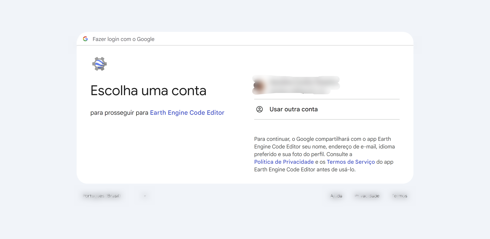
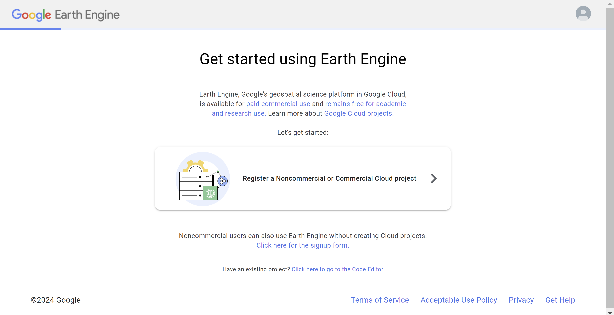
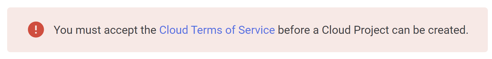
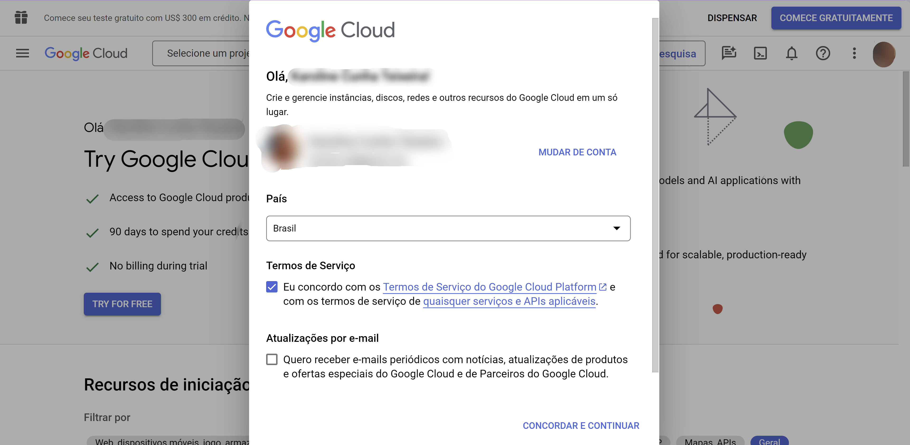
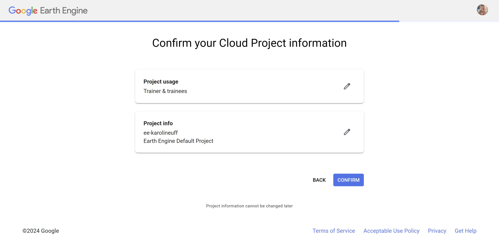
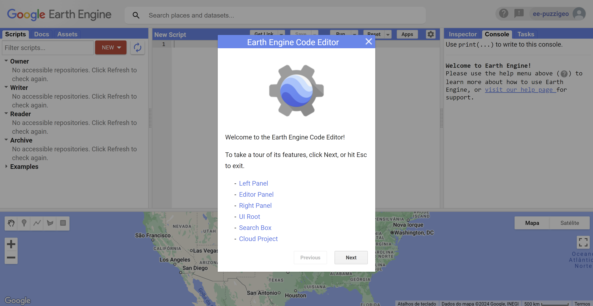

# GDG Joinville - Earth Engine

Conteúdo da palestra e do workshop de Earth Engine para o [Google Developers Group Joinville](https://gdg.community.dev/gdg-joinville/).

## Agenda

- 25 de Março (Online): [Palestra: O mundo das Geotecnologias - Ênfase no uso do Google Earth Engine](https://gdg.community.dev/events/details/google-gdg-joinville-presents-palestra-o-mundo-das-geotecnologias-enfase-no-uso-do-google-earth-engine/)
- 8 de Abril (Presencial): Workshop: Introdução ao Google Earth Engine 1
- 9 de Abril (Presencial): Workshop: Introdução ao Google Earth Engine 2

## Instrutora

**Andréa Puzzi Nicolau**

Cientista de Dados Geoespaciais da Spatial Informatics Group apoiando principalmente atividades para o programa SERVIR da USAID & NASA. 

Experiência em sensoriamento remoto, sistemas de informação geográfica (SIG) e análise geoespacial utilizando dados satelitais ópticos e de radar, inteligência artificial e processamento na nuvem. Google Developer Expert na categoria Earth Engine.

[andrea@puzzigeo.com](andrea@puzzigeo.com)

<a href="https://twitter.com/puzzinicolau" target="_blank">
    
<a href="https://www.linkedin.com/in/andreanicolau/" target="_blank">
    
<a href="https://scholar.google.com/citations?user=TrWGk2sAAAAJ&hl=en" target="_blank">
    
<a href="https://github.com/apuzzi" target="_blank">
    

## Pré-requisitos Workshop

- Conta da Google
- Cadastro no Google Earth Engine (GEE)
- Cloud Project dentro da Google Cloud Platform
- [*Opcional*] Google Chrome

### Passo-a-passo

1. Acesse [https://code.earthengine.google.com/register](https://code.earthengine.google.com/register) e selecione a sua conta da Google para realizar seu cadastro no GEE.

    
2. Clique em **Register a Noncommercial or Commercial Cloud Project**.

    
3. Na próxima página, selecione **Unpaid usage** e em *Project type* selecione **Trainer & trainees**. Clique em **NEXT**.

    
4. Selecione **Create a new Google Cloud Project**. Em *Organization*, selecione **No Organization**. Em *Project-ID* dê um identificador único para o seu cloud project. Em *Project Name* você pode dar um nome para fácil identificação desse cloud project. Clique em **CONTINUE TO SUMMARY**.

    
5. Se o erro "You must accept the Cloud Terms of Service before a Cloud Project can be created" aparecer, clique no link mostrado para aceitar os termos de serviço do Google Cloud. Uma nova página será aberta.

     
6. Selecione **Eu concordo com os Termos de Serviço do Google Cloud Platform e com os termos de serviço de quaisquer serviços e APIs aplicáveis**. Não se preocupe, você não será cobrado pelo uso do GEE nessa configuração para o treinamento. Clique em **Concordar e continuar**.

    
7. Volte para a aba ao lado e clique novamente em **CONTINUE TO SUMMARY**.
8. Reveja as informações e, finalmente, clique em **CONFIRM**.

    
9. A página será automaticamente redirecionada ao Code Editor. Você já pode realizar o Tour caso queira. Veremos todos os detalhes do Code Editor durante o Workshop.

    

## Perguntas

Se você tiver alguma dúvida sobre o material, envie uma pergunta abaixo! Estamos aqui para ajudar.

[Faça uma pergunta](https://docs.google.com/forms/d/e/1FAIpQLSdo8HM8EmUQ4Qia1oH2NFf5G8VxVFgCHlI4oR_92UF9vi_aJQ/viewform?usp=sharing){: .btn .btn-purple }

