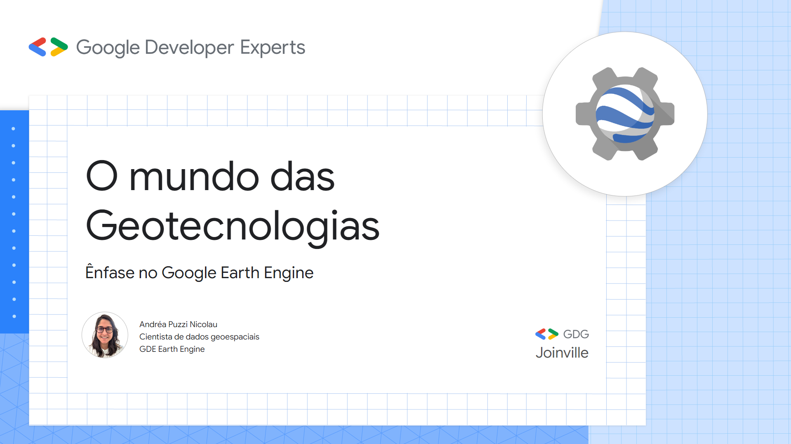
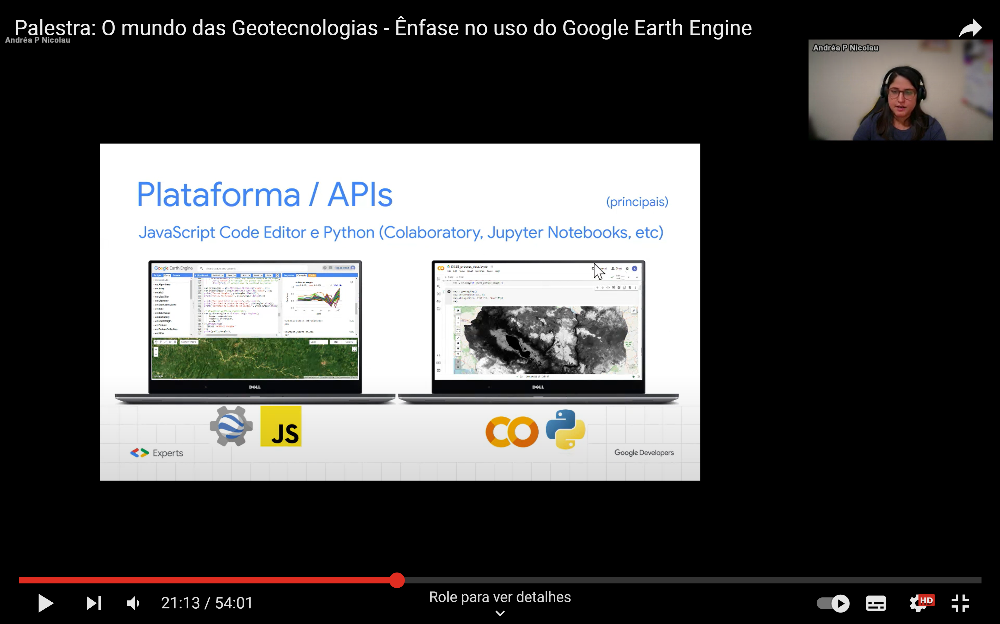

# Palestra: O mundo das Geotecnologias - Ênfase no uso do Google Earth Engine

**Dia**: 1 de abril de 2024

**Hora**: 19 horas

**Escopo**:
- Escopo Geral Geotecnologias (SIG, Sensoriamento remoto, GPS)
- Importância e Aplicações
- O que é o Google Earth Engine (GEE)
- Principais components da plataforma, APIs
- Importância do GEE
- Exemplos de scripts, apps, produtos
- Tecnologias emergentes
- Recursos do GEE

**Link para inscrição**: [https://gdg.community.dev/events/details/google-gdg-joinville-presents-palestra-o-mundo-das-geotecnologias-enfase-no-uso-do-google-earth-engine/](https://gdg.community.dev/events/details/google-gdg-joinville-presents-palestra-o-mundo-das-geotecnologias-enfase-no-uso-do-google-earth-engine/)

**Acesso Slides**:

**Gravação no Youtube**:

