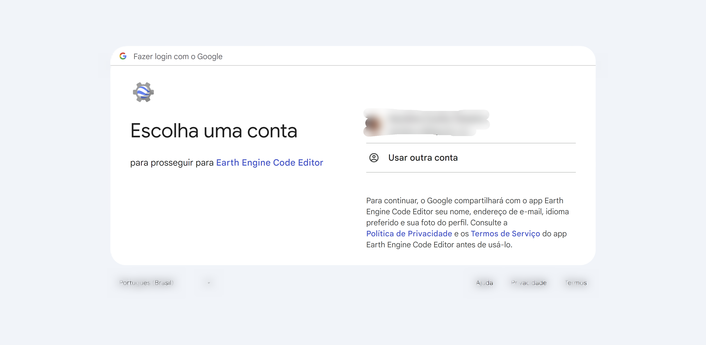
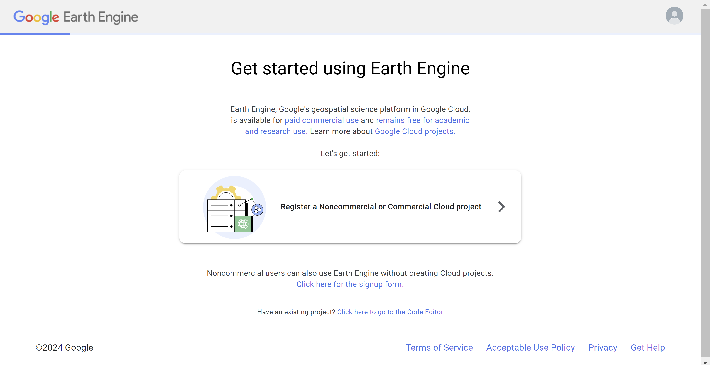
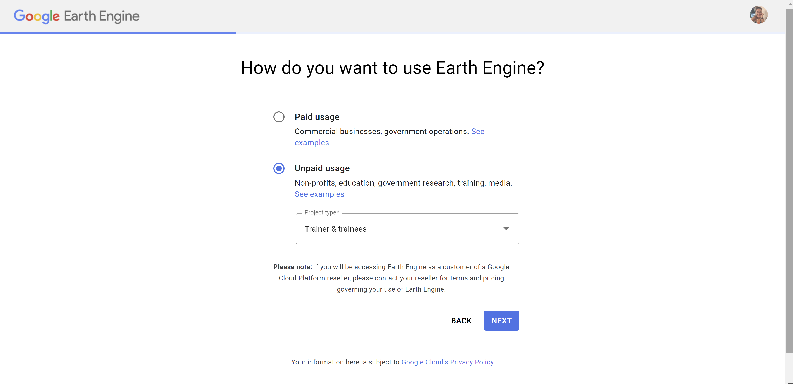
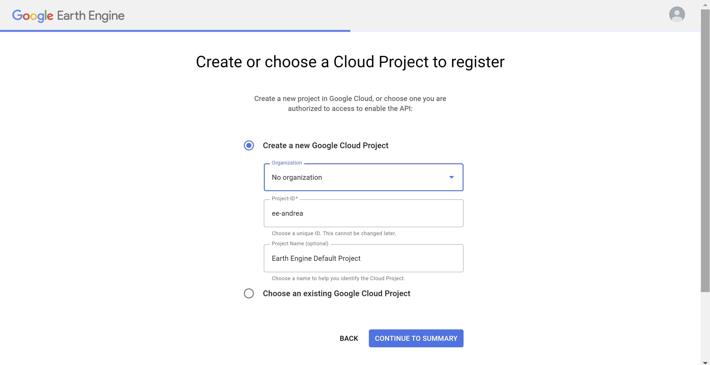
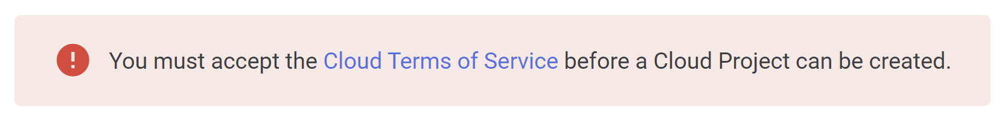
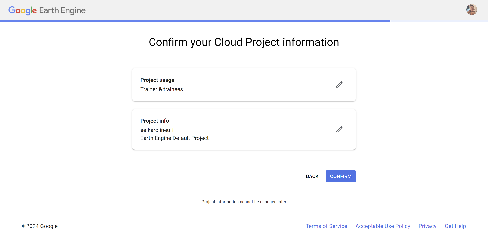
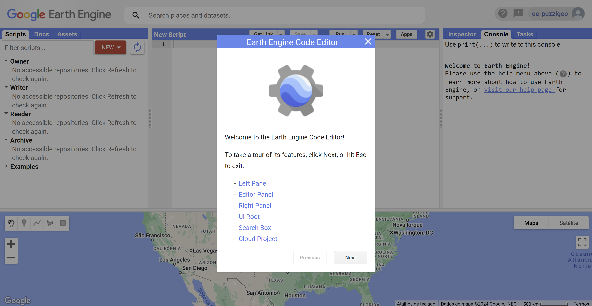

# Workshop: Introdução ao Earth Engine

**Dias**: 8 e 9 de Abril de 2024

**Hora**: 9 às 16 horas

Link para inscrição:
- Sessão 1: 
- Sessão 2:

## Pré-requisitos Workshop

- [Conta da Google](https://accounts.google.com/signup)
- Cadastro no Google Earth Engine (GEE)
- Cloud Project dentro da Google Cloud Platform
- [*Opcional*] Google Chrome

### Passo-a-passo

1. Acesse [https://code.earthengine.google.com/register](https://code.earthengine.google.com/register) e selecione a sua conta da Google para realizar seu cadastro no GEE.

    
    
    
    
    
2. Clique em **Register a Noncommercial or Commercial Cloud Project**.

    
3. Na próxima página, selecione **Unpaid usage** e em *Project type* selecione **Trainer & trainees**. Clique em **NEXT**.

    
4. Selecione **Create a new Google Cloud Project**. Em *Organization*, selecione **No Organization**. Em *Project-ID* dê um identificador único para o seu cloud project. Em *Project Name* você pode dar um nome para fácil identificação desse cloud project. Clique em **CONTINUE TO SUMMARY**.

    
5. Se o erro "You must accept the Cloud Terms of Service before a Cloud Project can be created" aparecer, clique no link mostrado para aceitar os termos de serviço do Google Cloud. Uma nova página será aberta.

     
6. Selecione **Eu concordo com os Termos de Serviço do Google Cloud Platform e com os termos de serviço de quaisquer serviços e APIs aplicáveis**. Não se preocupe, você não será cobrado pelo uso do GEE nessa configuração para o treinamento. Clique em **Concordar e continuar**.

    
7. Volte para a aba ao lado e clique novamente em **CONTINUE TO SUMMARY**.
8. Reveja as informações e, finalmente, clique em **CONFIRM**.

    
9. A página será automaticamente redirecionada ao Code Editor. Você já pode realizar o Tour caso queira. Veremos todos os detalhes do Code Editor durante o Workshop.

    